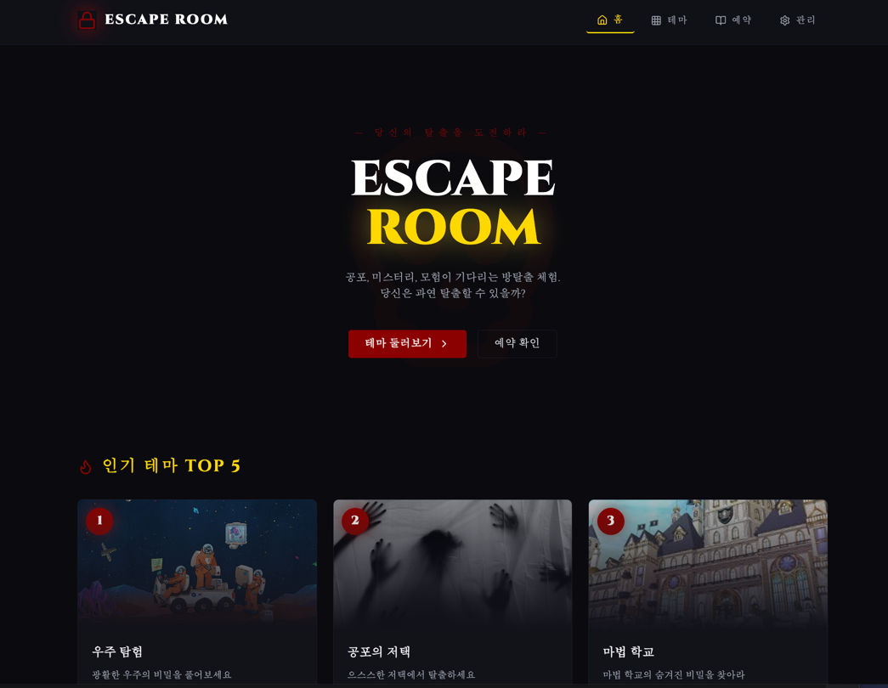
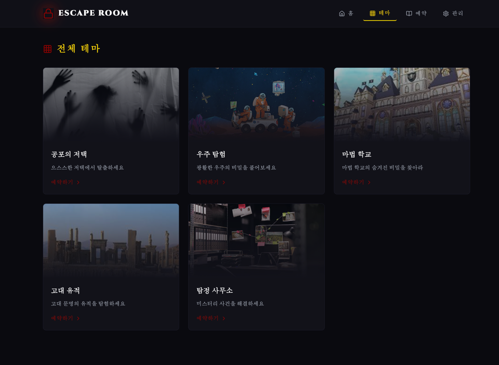
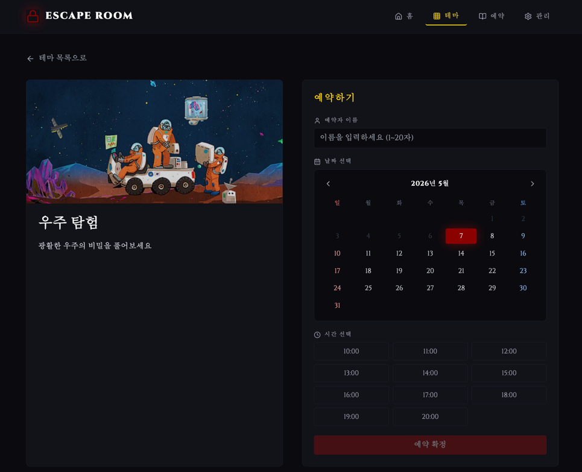
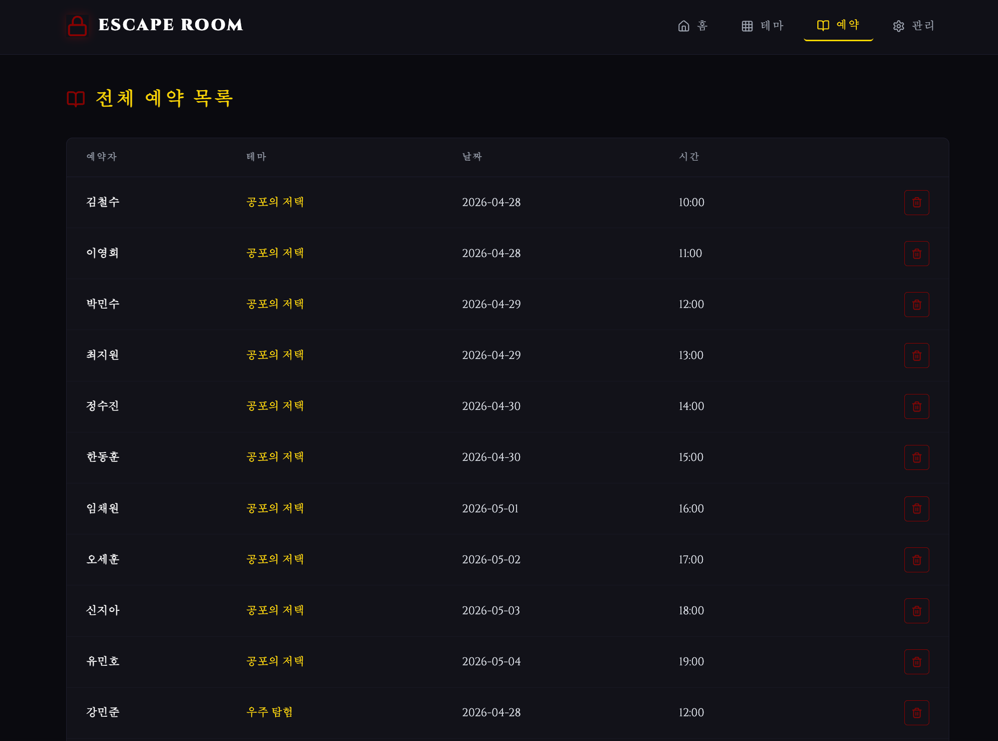
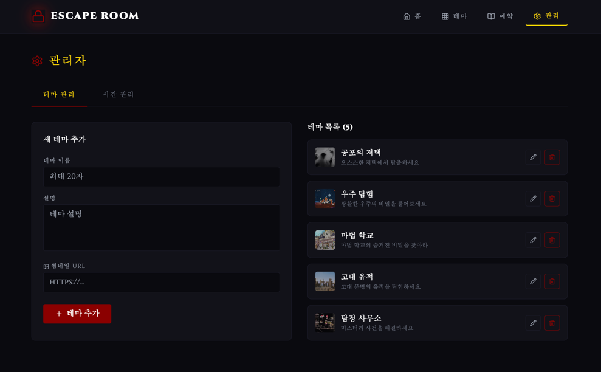

# 방 탈출 예약 시스템

방 탈출 테마를 예약하고 관리할 수 있는 풀스택 웹 애플리케이션입니다.

- **Backend**: Spring Boot 3.4 / Java 21 / H2 (in-memory)
- **Frontend**: Vue (별도 레포)
- **Infrastructure**: Docker Compose

---

## 📸 화면 미리보기

### 🏠 메인 화면
ESCAPE ROOM 히어로 섹션과 인기 테마 TOP 5 카드를 보여주는 랜딩 페이지.



---

### 🎨 테마 목록
모든 방 탈출 테마를 카드 형태로 조회할 수 있는 페이지.



---

### 🎮 테마 상세 — 우주 탐험
광활한 우주의 비밀을 풀어보는 SF 컨셉 테마.



---

### 📅 예약 화면
날짜와 테마를 선택하면 예약 가능한 시간이 자동 필터링되는 예약 흐름.



---

### ⚙️ 관리자 페이지
관리자가 테마와 예약 시간을 추가/삭제할 수 있는 화면.



---

## 🖥️ 로컬 실행 방법

### 사전 준비
- [Docker Desktop](https://www.docker.com/products/docker-desktop/) 설치 및 실행

### 실행

레포 루트에서 다음 명령어를 실행하면 백엔드와 프론트엔드가 함께 실행됩니다.

    chmod +x setup.sh
    ./setup.sh

스크립트가 자동으로 다음을 처리합니다:
1. 프론트엔드 레포 클론 (상위 디렉토리에 sibling으로)
2. `docker-compose.yml`을 상위 디렉토리로 복사
3. Docker Compose 빌드 및 백그라운드 실행

### 접속

| 서비스             | URL                   | 비고                     |
|-----------------|-----------------------|------------------------|
| 🌐 **프론트엔드**    | http://localhost:4173 | **여기로 접속하세요**          |
| 🔌 백엔드 API      | http://localhost:8080 | REST API 전용            |

> ⚠️ `localhost:8080`을 브라우저로 직접 열면 `No static resource .` 에러가 표시되지만 이는 정상입니다.
> 백엔드는 REST API 서버이고 정적 리소스를 제공하지 않습니다.

### 디렉토리 구조 (스크립트 실행 후)

    parent/
    ├── docker-compose.yml              # 자동 복사됨
    ├── spring-roomescape-member/       # 백엔드 (현재 레포)
    └── spring-roomescape-member-front/ # 프론트엔드 (자동 클론됨)

### 종료

    cd ..
    docker compose down

### 로그 확인 (트러블슈팅)

    cd ..
    docker compose logs backend
    docker compose logs frontend

---

## 🧪 독립된 환경에서 검증하기 (선택)

기존 작업 환경을 건드리지 않고 깨끗한 임시 디렉토리에서 테스트하고 싶다면:

### 1. 임시 디렉토리에서 클론 & 실행

    mkdir -p ~/tmp/roomescape-test
    cd ~/tmp/roomescape-test
    git clone -b e9ua1 https://github.com/Woowa-8th-BE-IQ/spring-roomescape-member.git
    cd spring-roomescape-member
    chmod +x setup.sh && ./setup.sh

### 2. 동작 확인

    cd ~/tmp/roomescape-test

    # 컨테이너 두 개 다 떠있는지
    docker compose ps

    # API 응답 정상인지
    curl -s http://localhost:8080/themes | head -c 200

    # 백엔드 로그에 부팅 에러 없는지
    docker compose logs backend --tail 30

브라우저에서 http://localhost:4173 접속해서 화면도 확인.

### 3. 완전 정리 (이미지 / 볼륨 / 디렉토리까지 전부 삭제)

    cd ~/tmp/roomescape-test

    # 컨테이너 + 빌드 이미지 + 볼륨 + 네트워크 삭제
    docker compose down --rmi all --volumes --remove-orphans

    # 임시 디렉토리 삭제
    cd ~ && rm -rf ~/tmp/roomescape-test

    # 댕글링 캐시 정리 (선택)
    docker system prune -f

### 4. 정리 확인

    docker ps -a | grep roomescape   # 출력 없어야 함
    docker images | grep roomescape  # 출력 없어야 함
    ls ~/tmp/roomescape-test 2>/dev/null && echo "남아있음" || echo "삭제 완료"

---

## 📁 관련 레포지토리

- 프론트엔드: https://github.com/Woowa-8th-BE-IQ/spring-roomescape-member-front

---

## 📋 기능 목록

### 테마

- [x] 관리자가 테마를 추가/삭제할 수 있다.
- [x] 테마 내역은 이름, 설명, 썸네일 이미지 URL을 갖는다.
- [x] 예약 내역에는 테마 정보가 포함된다.

### 사용자 예약

- [x] 사용자가 날짜와 테마를 선택하면 예약 가능한 시간 목록이 표시된다.
  - [x] 예약 가능한 시간이란 이전 예약 리스트에 동일한 날짜 + 테마의 예약이 없는 시간이다.
- [x] 예약할 때 이름을 입력받아야 하고, 예약 기록에 이름을 포함한다.
- [x] 테마가 다르다면 동일한 시간에 동일한 이름을 가진 예약을 할 수 있다.
- [x] 사용자가 이름으로 자신의 예약 목록을 조회할 수 있다.
- [x] 사용자가 본인의 예약 날짜·시간을 변경할 수 있다.
- [x] 사용자가 본인의 예약을 취소할 수 있다.

### 인기 테마 조회

- [x] 최근 1주 동안 예약이 많았던 테마 상위 10개를 조회할 수 있다.
- [x] 조회 기준은 오늘을 제외한 이전 7일을 기준으로 한다.

### 서비스 정책

- [x] 지나간 날짜·시간에 대한 예약 생성은 불가능하다.
- [x] 같은 날짜+시간+테마에 이미 예약이 있으면 중복 예약을 거부한다.
- [x] 예약이 존재하는 시간을 삭제할 수 없다.
- [x] 이미 지난 예약의 취소는 허용한다.

### 구현 관련

- [x] `data.sql`에 기본 시간을 추가해둔다.

---

## ⚠️ 에러 응답 명세

### 응답 형식

모든 에러 응답은 아래 JSON 형식을 따릅니다.

```json
{
  "message": "에러 원인 설명"
}
```

### 상태 코드 기준

| 상태 코드 | 의미 | 예시 |
|---|---|---|
| `400 Bad Request` | 요청 형식·필수값 오류 | 날짜 누락, 이름 형식 오류, 날짜 형식 오류 |
| `404 Not Found` | 리소스가 존재하지 않음 | 존재하지 않는 예약·시간·테마 조회 또는 삭제 |
| `409 Conflict` | 중복 또는 참조 중인 리소스 충돌 | 중복 예약, 예약이 존재하는 시간 삭제 |
| `422 Unprocessable Entity` | 비즈니스 규칙 위반 | 과거 날짜 예약 생성, 과거 날짜로 변경 |
| `500 Internal Server Error` | 서버 내부 오류 | DB 오류 등 |

---

## 📡 API 명세

### 사용자 API

| 기능 | 메서드 / URL | 요청 본문 | 쿼리 파라미터 | 응답 |
|---|---|---|---|---|
| 전체 예약 조회 | `GET /reservations` | - | - | `200 OK` |
| 이름으로 예약 조회 | `GET /reservations` | - | `name` | `200 OK` |
| 예약 추가 | `POST /reservations` | `{name, themeId, date, timeId}` | - | `201 Created` |
| 예약 변경 | `PATCH /reservations/{id}` | `{date, timeId}` | - | `200 OK` |
| 예약 취소 | `DELETE /reservations/{id}` | - | - | `204 No Content` |
| 시간 조회 | `GET /times` | - | `date`, `themeId` | `200 OK` |
| 테마 목록 조회 | `GET /themes` | - | - | `200 OK` |
| 테마 단건 조회 | `GET /themes/{id}` | - | - | `200 OK` |
| 인기 테마 조회 | `GET /themes/famous` | - | `days`, `date`, `limit` | `200 OK` |

### 어드민 API

| 기능 | 메서드 / URL | 요청 본문 | 응답 |
|---|---|---|---|
| 시간 추가 | `POST /times` | `{startAt}` | `201 Created` |
| 시간 삭제 | `DELETE /times/{id}` | - | `204 No Content` |
| 테마 생성 | `POST /themes` | `{name, description, thumbnailUrl}` | `201 Created` |
| 테마 삭제 | `DELETE /themes/{id}` | - | `204 No Content` |
