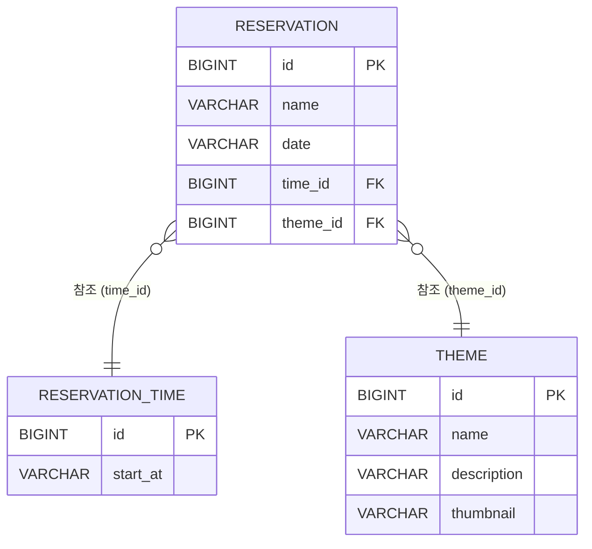

## 방탈출 사용자 예약

---

## 실행 가이드

### 요구 사항

- Java 21

### 실행 방법

```bash
git clone -b step1 https://github.com/haechanmoon/spring-roomescape-member.git
cd spring-roomescape-member
./gradlew bootRun
```

### 접속

- 사용자 페이지: http://localhost:8080
- 관리자 페이지: http://localhost:8080/admin

---

## ERD



---

## Cycle1 기능 구현 목록

<details>
<summary>1단계 - 테마 도메인 추가</summary>

- [x] API 명세 작성

 ```
    테마 조회	GET /themes	        —	                     [{id, name, description, thumbnail}...]
    테마 추가	POST /admin/themes	   {name, description, thumbnail}    {id, name, description, thumbnail}
    테마 삭제	DELETE /admin/themes/{id}	—	                     200 OK
```

- [x] 테마 테이블 구현
- [x] 테마 도메인 구현
- [x] 테마 DTO 구현
- [x] 테마 DAO 구현
- [x] 테마 Service 구현
- [x] 테마 Controller 구현
- [x] 예약에 테마 정보 포함하도록 기존 메인 코드 변경
- [x] 예약에 테마 정보 포함하도록 기존 테스트 코드 변경
- [x] http메서드에 상태코드 구현
- [x] `ThemeDao`, `ThemeService`, `ReservationDAO`, `ReservationService` 테스트 구현

</details>

<details>
<summary>2단계 - 사용자 예약</summary>

- [x] API 명세 작성

 ```
    예약 가능 시간 조회    GET /themes/1/reservation-times?date=2026-05-08         -        [{id, startAt, available}...]
```

- [x] 예약 가능한 시간인 ReservationTimeStatusResponse Dto 구현
- [x] ReservationDao에서 사용자가 선택한 날짜와 테마에 해당하는 예약시간Id를 가져오는 메서드 구현
- [x] ThemeService에서 예약 가능한 시간을 계산하는 메서드 구현
- [x] 예약 가능 시간 조회 Controller 구현
- [x] 같은 시간, 같은 테마, 같은 날짜 중복 예약 불가 검증 구현

</details>

<details>
<summary>3단계 - 인기 테마 조회</summary>

- [x] API 명세 작성

 ```
    인기 테마 조회    GET /themes/popular             -             [{id, name, description, thumbnail, reservationCount}...]
```

- [x] 인기 테마 조회 응답 dto 구현
- [x] 인기 테마 도메인 구현
- [x] 인기 테마 조회 dao 구현
- [x] 인기 테마 조회 service 구현
- [x] 인기 테마 조회 controller 구현

</details>

<details>
<summary>SQL, 추가</summary>

- [x] data.sql 구현
- [x] 화면 구현

</details>

---

## Cycle1 기록

<details>
<summary>📝 Cycle1 토론규칙</summary>

```
1. 리소스 식별 기준

(If-Then) 만약 사용자가 실제로 조회하고 싶은 대상이 있고, 다른 값들은 그 대상을 좁히기 위한 조건이라면
         → 조회 대상은 리소스로 두고, 나머지 값들은 쿼리 파라미터로 표현한다.
         (이유: 리소스는 사용자가 받고 싶은 핵심 대상을 기준으로 식별하고, 조건 값들은 그 결과를 필터링하는 역할이기 때문이다.)

2. 서버/클라이언트 책임 기준

(If-Then) 만약 어떤 값의 판단은 서버만 할 수 있지만, 그 결과를 어떻게 보여줄지는 클라이언트가 결정해도 된다면
         → 서버는 판단 결과를 포함한 원본 데이터를 내려주고, 클라이언트가 이를 기준으로 필터링하거나 표시 방식을 결정한다.
         (이유: 정합성과 비즈니스 규칙 판단은 서버의 책임이고, 화면 표현과 사용자 경험은 클라이언트의 책임이기 때문이다.)

3. 관리자/사용자 API 분리 기준

(If-Then) 만약 관리자와 사용자가 같은 리소스를 조회하더라도, 권한에 따라 제공해야 하는 정보나 수행 가능한 동작이 달라진다면
                → URL은 같게 두고 권한으로 분기한다.
         (이유: 같은 리소스를 다루더라도 목적, 응답 범위, 책임이 달라지면 엔드포인트를 분리하는 편이 더 명확하다.)

4. 우리 그룹의 "좋은 API" 정의 
만약 API를 추가해야한다면
-> 이미 구현되어있는 API를 재사용 할 수 있는지 확인한다.
(재사용 가능한 API를 좋은 API라고 부른다.)

(우선순위) URL을 결정할 때 순서:
         1) 리소스를 명확히 한다 (명사형, 복수형)
         2) 행위를 HTTP 메서드로 표현한다
         3) 부가 조건은 쿼리/경로/본문 중 의미에 맞게 배치

(금지) 1. 이번 사이클에서 동사형 URL은 쓰지 않는다 (예: /reservations/create)
      이유: HTTP 메서드가 이미 동사 역할을 한다
      
      2. 화면 명세가 바뀌었을 때 API가 바뀌면 안된다.
      이유: 화면 명세가 바뀌었을 때 API가 수정되면, 화면에 API가 종속되어 재사용이 불가능하다는 신호이기 때문이다.
```

</details>

<details>
<summary>📓 Cycle1 미션 진행중 작성</summary>

- **규칙때문에 바뀐점** :
    - 관리자와 사용자의 구분을 하지 않았었다.
    - Get은 사용자와 관리자 같이 사용가능하고 Post와 Delete는 관리자에게만 하도록 URL 에서 /admin을 따로 주었다.
    - 단, 사용자가 예약을 생성해야하므로 post/reservations는 /admin을 포함하지 않는다.

- **막혔던 부분** :
    - 2단계에서 `날짜와 테마를 선택하면 예약 가능한 시간 목록`을 구현할 때 SQL문이 생각이 나지 않았다.
    - 해결: ReservationTime 을 전체 가능한 시간을 두고 예약된 시간을 제거하니 가능한 시간이 추출되었다.

- **테스트 작성이 어려웠던 부분**:
    - "지난 날짜는 예약할 수 없습니다."라는 에러를 뱉으며 실패했다.
    - 원인 파악: `ThemeServiceTest` 등에서 예약 날짜를 `2024-05-01` 같은 특정 날짜로 하드코딩해 두었기 때문이었다.
      시간이 지나면서 그 날짜가 과거가 되어버렸고, 과거로직 방지 코드에 걸려 실패했다.
    - 해결: 날짜와 시간에 의존적인 로직을 테스트할 때는, 항상 미래의 날짜(예: 2030-05-06)를 하드코딩하거나
      `LocalDate.now().plusDays(1)`처럼 동적으로 현재 시간 기준 미래를 계산하도록 짜야 한다는 것을 깨달았다.

</details>

---

## Cycle1 리팩토링

<details>
<summary>리뷰 받은 후 리팩토링 목록</summary>
- **READ.ME**
- [x] PR본문 관련 코멘트 작성
- [x] 실행 가이드 문서화
- [x] ERD 문서화

- **ThemeServiceTest**
- [x] SpringBootTest, DirtiesContext 작동법 / 장단점 / 단점 대체법 알아보기
- [x] JdbcTemplate 활용하여 -> SpringBootTest, DirtiesContext제거


- **ReservationDaoTest**
- [x] Dao에 Service의존 문제 해결
- [x] @JdbcTest 활용 -> SpringBootTest, DirtiesContext제거


- **ThemeService**
- [x] '7','30' 하드코딩 상수화
- [x] `findReservationTimeByDateAndThemeId()` 로직 분리
- [x] `timeIds.contains()` 시간 복잡도 알아보기


- **PopularTheme**
- [x] 도메인인지 DTO인지 고민 후 수정


- **Reservation**
- [x] 이름 검증 로직 - '빈 칸일 경우'/ '이름이 너무 길 때' 메시지 응답 분리
- [x] 하드코딩 숫자 상수화


- **ThemeDao**
- [x] 테스트 필요성 인식 및 작성


- **ReservationTimeDao**
- [x] `findAll()` 로직 테스트 작성


- **ReservationDao**
- [x] 예약자 이름 정렬 취소(이미 정렬 완료)
- [x] count대신 exist사용
- [x] `existByDateAndTimeIAndThemeId` 메서드명 변경


- **ReservationTimeController**
- [x] 컨트롤러에서 어떤 행동을 할 지 명확히 드러나도록 중복된 메서드명 변경


- **GlobalExceptionHandler**
- [x] `EmptyResultDataAccessException` 대체할 예외 찾기(너무 구체적이기 때문에)

</details>

<details>
<summary>두번째 리뷰 리팩토링</summary>

- **GlobalExceptionHandler**
- [x] 단순 문자열 반환하는것이 아닌 JSON객체 반환되도록 수정

- **DAO**
- [x] exist는 0과1을 반환하기 때문에 `Integer.class` 대신 `Boolean.class`이용하도록 수정

- **가짜서버란 무엇일까?**
- [x] 테스트에 SpringBootTest에서 `DEFINED_PORT`를 입력하면 8080포트를 열어서 HTTP 요쳥받을 수 있는 서버를 띄운다.
  하지만 `webEnvironment=NONE`으로 하면 포트는 열지 않는다. 컨테이너는 있지만, HTTP 요청은 받을 수 없는 상태가 된다.
- [x] `DirtiesContext`를 쓰지 않을 때? -> 스프링은 최대한 재활용하려고 한다!

- **스프링의 컨테이너 재활용 타이밍**
- [x] 컨테이너의 설정이 달라졌을 때 이다!
- [x] ex) `SpringBootTest -> SpringBootTest` 컨테이너 재활용
- [x] ex) `SpringBootTest -> JdbcTest` 컨테이서 새로 만듦

</details>

---

## Cycle2  기능 구현 목록

<details>
<summary>1단계 - 서비스 정책 적용</summary>
- ㅇ
- ㅇ

</details>

<details>
<summary>2단계 - 에러 응답 설계</summary>
- ㅇ
- ㅇ
- ㅇ
</details>

<details>
<summary>3단계 - 내 예약 조회/변경/취소</summary>
- ㅇ
- ㅇ

</details>

---

## Cycle2 기록

<details>
<summary>📝 Cycle1+Cycle2 토론규칙</summary>

```text
사이클1

1. 리소스 식별 기준
(If-Then) 만약 조회 대상이 특정 기능이나 문맥 안에서만 의미를 가진 결과라면
    → 상위 문맥을 리소스 경로에 포함하고 조건 값은 쿼리 파라미터로 표현하며, 에러 응답 본문에는 상위 리소스와 문맥을 결합하여 언급한다.
    (리소스 간의 종속 관계를 명확히 하고, 어떤 상위 자원의 하위 맥락에서 에러가 발생했는지 정보를 제공하기 위함)

2. 서버/클라이언트 책임 기준

(If-Then) 만약 어떤 값의 판단은 서버만 할 수 있지만, 그 결과를 어떻게 보여줄지는 클라이언트가 결정해도 된다면
    → 서버는 판단 결과를 포함한 원본 데이터를 내려주고, 클라이언트가 이를 기준으로 필터링하거나 표시 방식을 결정한다.
    (이유: 정합성과 비즈니스 규칙 판단은 서버의 책임이고, 화면 표현과 사용자 경험은 클라이언트의 책임이기 때문이다.)
(If-Then) 만약 에러 상황에서 무엇이 잘못되었는지는 서버가 판단할 수 있지만, 그 이후 사용자가 어떤 행동을 취하도록 안내할지는 클라이언트가 결정해도 된다면
    → 서버는 에러의 원인과 상태를 식별할 수 있는 정보만 명시적으로 내려주고, “다음에 무엇을 해야 하는지”에 대한 안내 문구나 행동 제안은 클라이언트가 표현한다.
    (이유: 다음 행동에 대한 안내는 화면 흐름과 사용자 경험에 따라 쉽게 바뀔 수 있는 표현 계층의 책임이며, 이를 백엔드가 직접 내려주면 응답이 특정 UI에 과하게 종속되고 변경 시 백엔드 수정 및 재배포가 필요해질 수 있기 때문이다.)

3. 관리자/사용자 API 분리 기준
(If-Then) 만약 관리자와 사용자가 같은 리소스를 조회하더라도 접근 권한이나 노출 데이터 범위가 다르다면    → URL을 분기하고, 에러 응답 본문에도 해당 권한 맥락(Admin/User)이 드러나도록 이름을 짓는다.    (같은 리소스를 다루더라도 목적, 응답 범위, 책임이 달라지므로 엔드포인트를 분리하고 에러 발생 시에도 어떤 권한의 요청에서 문제가 생겼는지 명확히 하기 위함)

4. 우리 그룹의 "좋은 API" 정의 
좋은 API란, 리소스의 맥락이 URI에 일관되게 드러나고, 서버가 비즈니스 판단 결과를 명시적으로 전달하여 클라이언트가
 추가 추론 없이 사용할 수 있으며, 새로운 기능이 필요할 때도 기존 API를 최대한 재사용할 수 있는 API라고 정의했다.

(우선순위) URL을 결정할 때 순서:
         1) 리소스를 명확히 한다 (명사형, 복수형)
         2) 행위를 HTTP 메서드로 표현한다
         3) 부가 조건은 쿼리/경로/본문 중 의미에 맞게 배치

(금지) 1. 이번 사이클에서 동사형 URL은 쓰지 않는다 (예: /reservations/create)
      이유: HTTP 메서드가 이미 동사 역할을 한다
      
      2. 화면 명세가 바뀌었을 때 API가 바뀌면 안된다.
      이유: 화면 명세가 바뀌었을 때 API가 수정되면, 화면에 API가 종속되어 재사용이 불가능하다는 신호이기 때문이다.

사이클2

5. 에러 응답 수신자 기준

(If-Then) 만약 에러 응답의 주 수신자가 프론트엔드 개발자이고, 이를 통해 UI/UX를 제어해야 한다면 
    → 응답 본문에 HTTP 상태 코드, 서비스 전용 에러 코드, 메시지를 모두 포함한다.    (프론트엔드에서 상태 코드로 공통 에러를 처리함과 동시에, 상세 에러 코드를 통해 필드별 에러 강조나 토스트 메시지 노출 등 UI 분기 처리를 정교하게 수행하기 위함)

6. 비즈니스 규칙 위반 시 응답 기준

(If-Then) 만약 비즈니스 규칙(중복 예약, 과거 날짜, 존재하지 않는 리소스 등)을
         위반한 요청이라면
         → 4xx 상태 코드 + 무엇이 위반됐는지를 본문에 담는다.

(If-Then) 만약 요청한 리소스가 존재하지 않는다면
         → 400이 아닌 404를 반환한다.
         (이유: 400은 "요청 형식이 잘못됨", 404는 "리소스가 없음"으로
          의미가 다르고, 프론트 코드가 구분할 수 있어야한다.)

7. 응답 본문에 "다음 행동"을 담는 기준
우리 팀은 에러 응답 본문에 다음 행동을 직접 담지 않기로 결정했다.이유는 다음 행동은 서버가 항상 정확하게 판단하기 어렵고, 
같은 에러라도 화면의 흐름이나 클라이언트 상황에 따라 사용자가 해야 할 행동이 달라질 수 있기 때문이다.

[우선순위] 에러 응답을 결정할 때 순서:
1. 요청 리소스와 권한 맥락을 파악한다 (Admin/User 및 리소스명 확인)
2. 의미에 맞는 정확한 HTTP 상태 코드를 결정한다 (특히 400 vs 404 구분)
3. 프론트엔드가 UI를 제어할 수 있도록 상세 에러 코드와 메시지를 구성한다

[금지] 이번 사이클에서 X는 하지 않는다
- 응답 본문에 "다음 행동(Next Action)"을 포함하지 않는다. 이유: 클라이언트의 UI 흐름 제어권을 보장하고 서버의 잘못된 판단을 방지하기 위함

```

</details>

<details>
<summary>📓 Cycle2 미션 진행중 작성</summary>

- **규칙에 의해 바뀐 점**
    - ㅇ

- **변경/최소에서 발견한 엣지 케이스와 처리 방향**
    - ㅇ

- **지금까지의 규칙 중 유지/수정/폐기한 항목**
    - ㅇ

</details>

---

## Cycle2 리팩토링

<details>
<summary>첫번째 리팩토링</summary>

</details>


<details>
<summary>두번째 리팩토링</summary>

</details>
