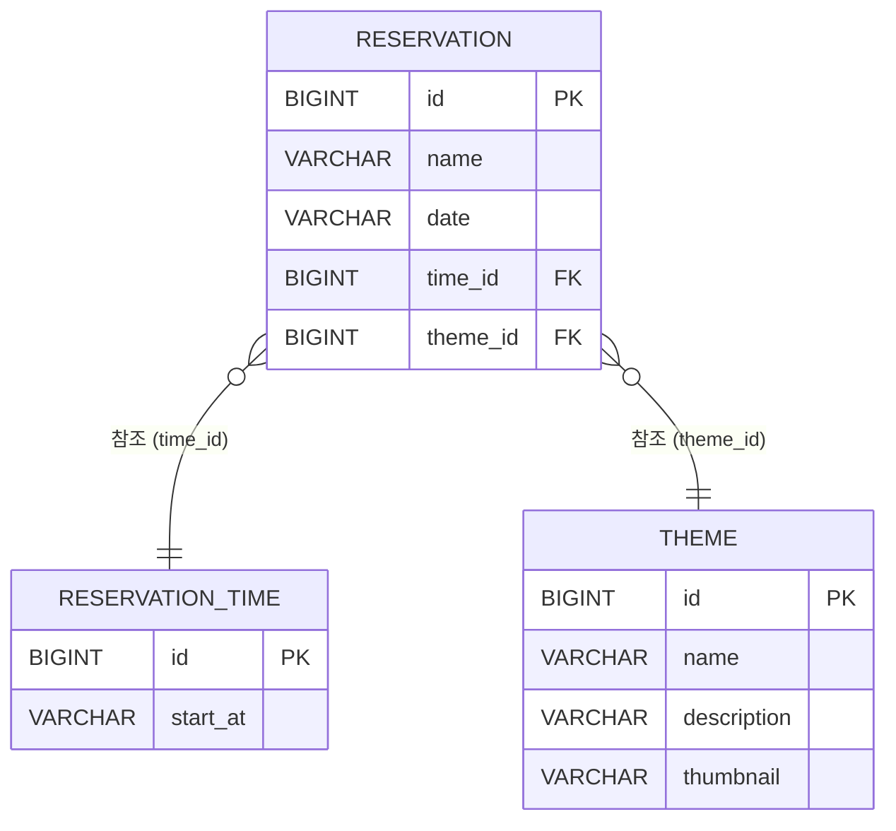

## 방탈출 사용자 예약

### 토론규칙

```
1. 리소스 식별 기준

(If-Then) 만약 사용자가 실제로 조회하고 싶은 대상이 있고, 다른 값들은 그 대상을 좁히기 위한 조건이라면
         → 조회 대상은 리소스로 두고, 나머지 값들은 쿼리 파라미터로 표현한다.
         (이유: 리소스는 사용자가 받고 싶은 핵심 대상을 기준으로 식별하고, 조건 값들은 그 결과를 필터링하는 역할이기 때문이다.)

2. 서버/클라이언트 책임 기준

(If-Then) 만약 어떤 값의 판단은 서버만 할 수 있지만, 그 결과를 어떻게 보여줄지는 클라이언트가 결정해도 된다면
         → 서버는 판단 결과를 포함한 원본 데이터를 내려주고, 클라이언트가 이를 기준으로 필터링하거나 표시 방식을 결정한다.
         (이유: 정합성과 비즈니스 규칙 판단은 서버의 책임이고, 화면 표현과 사용자 경험은 클라이언트의 책임이기 때문이다.)

3. 관리자/사용자 API 분리 기준

(If-Then) 만약 관리자와 사용자가 같은 리소스를 조회하더라도, 권한에 따라 제공해야 하는 정보나 수행 가능한 동작이 달라진다면
                → URL은 같게 두고 권한으로 분기한다.
         (이유: 같은 리소스를 다루더라도 목적, 응답 범위, 책임이 달라지면 엔드포인트를 분리하는 편이 더 명확하다.)

4. 우리 그룹의 "좋은 API" 정의 
만약 API를 추가해야한다면
-> 이미 구현되어있는 API를 재사용 할 수 있는지 확인한다.
(재사용 가능한 API를 좋은 API라고 부른다.)

(우선순위) URL을 결정할 때 순서:
         1) 리소스를 명확히 한다 (명사형, 복수형)
         2) 행위를 HTTP 메서드로 표현한다
         3) 부가 조건은 쿼리/경로/본문 중 의미에 맞게 배치

(금지) 1. 이번 사이클에서 동사형 URL은 쓰지 않는다 (예: /reservations/create)
      이유: HTTP 메서드가 이미 동사 역할을 한다
      
      2. 화면 명세가 바뀌었을 때 API가 바뀌면 안된다.
      이유: 화면 명세가 바뀌었을 때 API가 수정되면, 화면에 API가 종속되어 재사용이 불가능하다는 신호이기 때문이다.
```

### 미션 진행중 작성

- **규칙때문에 바뀐점** : 
    - 관리자와 사용자의 구분을 하지 않았었다.
    - Get은 사용자와 관리자 같이 사용가능하고 Post와 Delete는 관리자에게만 하도록 URL 에서 /admin을 따로 주었다.
    - 단, 사용자가 예약을 생성해야하므로 post/reservations는 /admin을 포함하지 않는다.

- **막혔던 부분** : 
    - 2단계에서 `날짜와 테마를 선택하면 예약 가능한 시간 목록`을 구현할 때 SQL문이 생각이 나지 않았다.
    - 해결: ReservationTime 을 전체 가능한 시간을 두고 예약된 시간을 제거하니 가능한 시간이 추출되었다. 
  
- **테스트 작성이 어려웠던 부분**:
    - "지난 날짜는 예약할 수 없습니다."라는 에러를 뱉으며 실패했다.
    - 원인 파악: `ThemeServiceTest` 등에서 예약 날짜를 `2024-05-01` 같은 특정 날짜로 하드코딩해 두었기 때문이었다.
  시간이 지나면서 그 날짜가 과거가 되어버렸고, 과거로직 방지 코드에 걸려 실패했다.
    - 해결: 날짜와 시간에 의존적인 로직을 테스트할 때는, 항상 미래의 날짜(예: 2030-05-06)를 하드코딩하거나 
  `LocalDate.now().plusDays(1)`처럼 동적으로 현재 시간 기준 미래를 계산하도록 짜야 한다는 것을 깨달았다.

## 기능 구현 목록

#### 1단계 - 테마 도메인 추가

- [x] API 명세 작성

 ```
    테마 조회	GET /themes	        —	                     [{id, name, description, thumbnail}...]
    테마 추가	POST /admin/themes	   {name, description, thumbnail}    {id, name, description, thumbnail}
    테마 삭제	DELETE /admin/themes/{id}	—	                     200 OK
```

- [x] 테마 테이블 구현
- [x] 테마 도메인 구현
- [x] 테마 DTO 구현
- [x] 테마 DAO 구현
- [x] 테마 Service 구현
- [x] 테마 Controller 구현
- [x] 예약에 테마 정보 포함하도록 기존 메인 코드 변경
- [x] 예약에 테마 정보 포함하도록 기존 테스트 코드 변경
- [x] http메서드에 상태코드 구현
- [x] `ThemeDao`, `ThemeService`, `ReservationDAO`, `ReservationService` 테스트 구현


#### 2단계 - 사용자 예약
- [x] API 명세 작성
 ```
    예약 가능 시간 조회    GET /themes/1/reservation-times?date=2026-05-08         -        [{id, startAt, available}...]
```
- [x] 예약 가능한 시간인 ReservationTimeStatusResponse Dto 구현
- [x] ReservationDao에서 사용자가 선택한 날짜와 테마에 해당하는 예약시간Id를 가져오는 메서드 구현
- [x] ThemeService에서 예약 가능한 시간을 계산하는 메서드 구현
- [x] 예약 가능 시간 조회 Controller 구현
- [x] 같은 시간, 같은 테마, 같은 날짜 중복 예약 불가 검증 구현


#### 3단계 - 인기 테마 조회
- [x] API 명세 작성
 ```
    인기 테마 조회    GET /themes/popular             -             [{id, name, description, thumbnail, reservationCount}...]
```
- [x] 인기 테마 조회 응답 dto 구현
- [x] 인기 테마 도메인 구현
- [x] 인기 테마 조회 dao 구현
- [x] 인기 테마 조회 service 구현
- [x] 인기 테마 조회 controller 구현

#### SQL, 추가
- [x] data.sql 구현
- [x] 화면 구현

---

### 리뷰 받은 후 리팩토링 실행 목록

- **READ.ME**
- [x] PR본문 관련 코멘트 작성
- [ ] 실행 가이드 문서화
- [x] ERD 문서화


- **ThemeServiceTest**
- [x] SpringBootTest, DirtiesContext 작동법 / 장단점 / 단점 대체법 알아보기
- [ ] JdbcTemplate 활용하여 구현

- **ReservationDaoTest**
- [ ] Dao에 Service의존 문제 해결
- [ ] @JdbcTest 활용 -> SpringBootTest, DirtiesContext제거

- **ThemeService**
- [ ] '7','30' 하드코딩 상수화
- [ ] `findReservationTimeByDateAndThemeId()` 로직 분리
- [ ] `timeIds.contains()` 시간 복잡도 알아보기


- **PopularTheme**
- [ ] 도메인인지 DTO인지 고민해보기


- **Reservation**
- [ ] 이름 검증 로직 - '빈 칸일 경우'/ '이름이 너무 길 때' 메시지 응답 분리
- [ ] 하드코딩 숫자 상수화


- **ThemeDao**
- [ ] 테스트 필요성 인식 및 작성


- **ReservationTimeDao**
- [ ] `findAll()` 로직 테스트 작성


- **ReservationDao**
- [ ] 예약자 이름 정렬 취소(하나밖에 없기 때문에)
- [ ] count대신 exist사용
- [ ] `existByDateAndTimeIAndThemeId` 메서드명 변경


- **ReservationTimeController**
- [ ] 중복된 `read()` 메서드 명 변경
- [ ] `findAll()` 대신 `findAvailableTimes()`와 같은 메서드 명 변경


- **GlobalExceptionHandler**
- [ ] `EmptyResultDataAccessException` 대체할 예외 찾기(너무 구체적이기 때문에)


##  ERD


