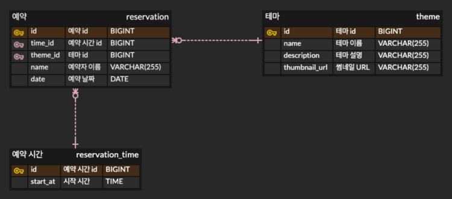

# 실행 가이드

### 요구 사항

Java 21

### 애플리케이션 실행

```bash
./gradlew bootRun
```

초기 샘플 데이터를 함께 넣어 실행하려면 local profile을 사용합니다.

```bash
./gradlew bootRun --args='--spring.profiles.active=local'
```

### 접속 경로

- 메인 페이지: http://localhost:8080
- 예약 페이지: http://localhost:8080/reservations
- 내 예약 페이지: http://localhost:8080/my-reservations
- 관리자 페이지: http://localhost:8080/admin

### 테스트 실행

```bash
./gradlew test
```

---

# ERD



# Roomescape API 명세서

> Base URL: `http://localhost:8080`  
> Content-Type: `application/json`

## 예약 API

| Method | URL | Request | Success | 설명 |
|--------|-----|---------|---------|------|
| `GET` | `/reservations?customerName={customerName}` | Query | `200 OK` | 예약자 이름으로 예약 목록 조회 |
| `GET` | `/reservations/date-and-theme` | - | `200 OK` | 예약 가능 날짜와 테마 조회 |
| `GET` | `/reservations/available-times?date={date}&themeId={themeId}` | Query | `200 OK` | 날짜와 테마별 예약 가능 시간 조회 |
| `POST` | `/reservations` | Body | `201 Created` | 예약 생성 |
| `PUT` | `/reservations/{reservation-id}` | Body | `200 OK` | 사용자 예약 일정 변경 |
| `DELETE` | `/reservations/{reservation-id}` | Path | `204 No Content` | 사용자 예약 취소 |

<details>
<summary>예약자 이름으로 예약 목록 조회 (<code>GET /reservations?customerName={customerName}</code>)</summary>

```http
GET /reservations?customerName=홍길동
```

```json
[
  {
    "id": 1,
    "name": "홍길동",
    "date": "2026-08-05",
    "time": {
      "id": 1,
      "startAt": "10:00:00"
    },
    "theme": {
      "id": 1,
      "name": "링",
      "description": "공포 테마",
      "thumbnailUrl": "http:~"
    }
  }
]
```

</details>

<details>
<summary>예약 가능 날짜와 테마 조회 (<code>GET /reservations/date-and-theme</code>)</summary>

```http
GET /reservations/date-and-theme
```

```json
{
  "dates": [
    "2026-08-05",
    "2026-08-06"
  ],
  "themes": [
    {
      "id": 1,
      "name": "링",
      "description": "공포 테마",
      "thumbnailUrl": "http:~"
    }
  ]
}
```

</details>

<details>
<summary>날짜와 테마별 예약 가능 시간 조회 (<code>GET /reservations/available-times</code>)</summary>

```http
GET /reservations/available-times?date=2026-08-05&themeId=1
```

```json
[
  {
    "id": 1,
    "startAt": "10:00:00",
    "reserved": false
  },
  {
    "id": 2,
    "startAt": "11:00:00",
    "reserved": true
  }
]
```

</details>

<details>
<summary>예약 생성 (<code>POST /reservations</code>)</summary>

```http
POST /reservations
Content-Type: application/json

{
  "name": "홍길동",
  "date": "2026-08-05",
  "timeId": 1,
  "themeId": 1
}
```

```json
{
  "id": 1,
  "name": "홍길동",
  "date": "2026-08-05",
  "time": {
    "id": 1,
    "startAt": "10:00:00"
  },
  "theme": {
    "id": 1,
    "name": "링",
    "description": "공포 테마",
    "thumbnailUrl": "http:~"
  }
}
```

</details>

<details>
<summary>사용자 예약 일정 변경 (<code>PUT /reservations/{reservation-id}</code>)</summary>

```http
PUT /reservations/1
Content-Type: application/json

{
  "date": "2026-08-06",
  "timeId": 2
}
```

```json
{
  "id": 1,
  "name": "홍길동",
  "date": "2026-08-06",
  "time": {
    "id": 2,
    "startAt": "11:00:00"
  },
  "theme": {
    "id": 1,
    "name": "링",
    "description": "공포 테마",
    "thumbnailUrl": "http:~"
  }
}
```

</details>

<details>
<summary>사용자 예약 취소 (<code>DELETE /reservations/{reservation-id}</code>)</summary>

```http
DELETE /reservations/1
```

```http
204 No Content
```

</details>

<details>
<summary>예약 주요 실패 응답</summary>

| 상황 | Status | Message |
|------|--------|---------|
| 필수 값 누락, 날짜 형식 오류 | `400 Bad Request` | `잘못된 요청입니다.` 또는 검증 메시지 |
| 과거 시간 예약/변경 | `400 Bad Request` | `과거 시간으로는 예약할 수 없습니다.` |
| 예약, 예약 시간, 테마 없음 | `404 Not Found` | `존재하지 않는 ...입니다.` |
| 이미 예약된 시간 | `409 Conflict` | `이미 예약된 시간입니다.` |
| 예약 옵션 상태 변경 | `409 Conflict` | `예약 가능한 시간 또는 테마 상태가 변경되었습니다.` |
| 당일 사용자 변경 | `409 Conflict` | `당일 예약은 변경할 수 없습니다.` |
| 당일 사용자 취소 | `409 Conflict` | `당일 예약은 취소할 수 없습니다.` |

```json
{
  "message": "이미 예약된 시간입니다."
}
```

</details>

## 관리자 예약 API

| Method | URL | Request | Success | 설명 |
|--------|-----|---------|---------|------|
| `GET` | `/admin/reservations` | - | `200 OK` | 전체 예약 목록 조회 |
| `PUT` | `/admin/reservations/{reservation-id}` | Body | `200 OK` | 관리자 예약 일정 변경 |
| `DELETE` | `/admin/reservations/{reservation-id}` | Path | `204 No Content` | 관리자 예약 삭제 |

<details>
<summary>전체 예약 목록 조회 (<code>GET /admin/reservations</code>)</summary>

```http
GET /admin/reservations
```

```json
[
  {
    "id": 1,
    "name": "홍길동",
    "date": "2026-08-05",
    "time": {
      "id": 1,
      "startAt": "10:00:00"
    },
    "theme": {
      "id": 1,
      "name": "링",
      "description": "공포 테마",
      "thumbnailUrl": "http:~"
    }
  }
]
```

</details>

<details>
<summary>관리자 예약 일정 변경 (<code>PUT /admin/reservations/{reservation-id}</code>)</summary>

```http
PUT /admin/reservations/1
Content-Type: application/json

{
  "date": "2026-08-06",
  "timeId": 2
}
```

```json
{
  "id": 1,
  "name": "홍길동",
  "date": "2026-08-06",
  "time": {
    "id": 2,
    "startAt": "11:00:00"
  },
  "theme": {
    "id": 1,
    "name": "링",
    "description": "공포 테마",
    "thumbnailUrl": "http:~"
  }
}
```

관리자 변경/삭제는 사용자 당일 변경·취소 제한을 적용하지 않습니다.

</details>

<details>
<summary>관리자 예약 삭제 (<code>DELETE /admin/reservations/{reservation-id}</code>)</summary>

```http
DELETE /admin/reservations/1
```

```http
204 No Content
```

</details>

## 예약 시간 API

| Method | URL | Request | Success | 설명 |
|--------|-----|---------|---------|------|
| `GET` | `/times` | - | `200 OK` | 전체 예약 시간 목록 조회 |
| `POST` | `/times` | Body | `201 Created` | 예약 시간 생성 |
| `DELETE` | `/times/{time-id}` | Path | `204 No Content` | 예약 시간 삭제 |

<details>
<summary>전체 예약 시간 목록 조회 (<code>GET /times</code>)</summary>

```http
GET /times
```

```json
[
  {
    "id": 1,
    "startAt": "10:00:00"
  },
  {
    "id": 2,
    "startAt": "11:00:00"
  }
]
```

</details>

<details>
<summary>예약 시간 생성 (<code>POST /times</code>)</summary>

```http
POST /times
Content-Type: application/json

{
  "startAt": "10:00"
}
```

```json
{
  "id": 1,
  "startAt": "10:00:00"
}
```

</details>

<details>
<summary>예약 시간 삭제 (<code>DELETE /times/{time-id}</code>)</summary>

```http
DELETE /times/1
```

```http
204 No Content
```

</details>

<details>
<summary>예약 시간 주요 실패 응답</summary>

| 상황 | Status | Message |
|------|--------|---------|
| 필수 값 누락 | `400 Bad Request` | 검증 메시지 |
| 예약 시간이 없음 | `404 Not Found` | `존재하지 않는 예약 시간입니다.` |
| 해당 시간에 예약이 있음 | `409 Conflict` | `해당 시간에 예약이 존재하여 삭제할 수 없습니다.` |

</details>

## 테마 API

| Method | URL | Request | Success | 설명 |
|--------|-----|---------|---------|------|
| `GET` | `/themes/popular` | - | `200 OK` | 최근 7일 인기 테마 조회 |
| `POST` | `/themes` | Body | `201 Created` | 테마 생성 |
| `DELETE` | `/themes/{theme-id}` | Path | `204 No Content` | 테마 삭제 |

<details>
<summary>인기 테마 조회 (<code>GET /themes/popular</code>)</summary>

```http
GET /themes/popular
```

```json
[
  {
    "id": 1,
    "name": "링",
    "description": "공포 테마",
    "thumbnailUrl": "http:~"
  }
]
```

</details>

<details>
<summary>테마 생성 (<code>POST /themes</code>)</summary>

```http
POST /themes
Content-Type: application/json

{
  "name": "링",
  "description": "공포 테마",
  "thumbnailUrl": "http:~"
}
```

```json
{
  "id": 1,
  "name": "링",
  "description": "공포 테마",
  "thumbnailUrl": "http:~"
}
```

</details>

<details>
<summary>테마 삭제 (<code>DELETE /themes/{theme-id}</code>)</summary>

```http
DELETE /themes/1
```

```http
204 No Content
```

</details>

<details>
<summary>테마 주요 실패 응답</summary>

| 상황 | Status | Message |
|------|--------|---------|
| 필수 값 누락 | `400 Bad Request` | 검증 메시지 |
| 테마가 없음 | `404 Not Found` | `존재하지 않는 테마입니다.` |
| 해당 테마에 예약이 있음 | `409 Conflict` | `해당 테마에 예약이 존재하여 삭제할 수 없습니다.` |

</details>

## 페이지 라우팅

| URL | 설명 |
|-----|------|
| `GET /` | 홈 화면 |
| `GET /reservations` | 예약 화면 |
| `GET /my-reservations` | 내 예약 화면 |
| `GET /admin` | 관리자 화면 |
