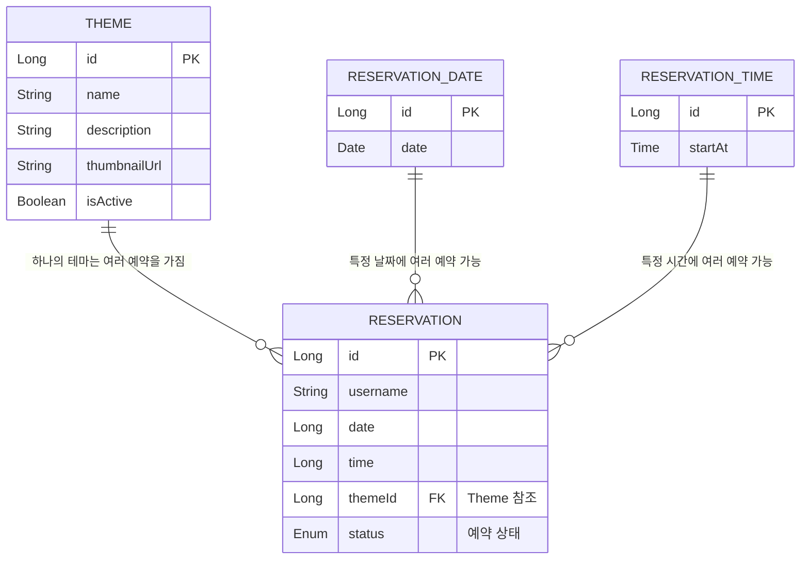

# 요구사항

> 사이클1 - 관리자 여부(인가)는 판단하지 않는다. 인가는 구현하지 않는다.

---

## 1. Reservation

`status` : `RESERVED` | `CANCELED`

### 관리자

**예약을 한다.**
- 날짜와 테마를 선택하고 예약 가능한 시간을 선택하면 예약할 수 있다.
- `dateId`, `timeId`, `themeId`, `status`를 검증한다. (이때, status가 `RESERVED`인지 검증)
- 예약의 기본 상태는 `RESERVED`이다.

**예약을 취소한다.**
- 해당 API를 사용한다는 게, 관리자임을 보장한다고 가정한다. 즉, 관리자인지 별도로 검증하지 않는다.
- 예약 상태를 `CANCELED`로 변경한다.

**예약을 조회한다.**
- 검색어(`username`)를 입력받을 수 있다. 검색어가 없다면 전체 조회한다.
- 필터링 조건은 `RESERVED`와 `CANCELED`가 존재한다.
- 예약 날짜와 예약 시간을 기준으로 내림차순 정렬한다.

### 사용자

**예약을 한다.**
- 날짜와 테마를 선택하고 예약 가능한 시간을 선택하면 예약할 수 있다.
- `dateId`, `timeId`, `themeId`, `status`를 검증한다. (이때, status가 `RESERVED`인지 검증)
- 예약의 기본 상태는 `RESERVED`이다.

**예약을 취소한다.**
- 예약자의 성함과 일치하는지 확인한다.
- 예약 상태를 `CANCELED`로 변경한다.

**예약을 조회한다.**
- `username`로 예약을 조회한다.
- Query Parameter로 `status`를 받는다. (nullable)
    - `status`가 null이면 `RESERVED`, `CANCELED` 모두 시간순으로 조회한다.
    - `status`가 하나 선택되면 해당 status로 필터링하고 시간순으로 조회한다.

---

## 2. ReservationDate

### 관리자

**예약 가능한 날짜를 생성한다.**
- `date`를 보내 생성한다.
  - 이미 존재하는 `date`라면 예외가 발생한다.

**예약 가능한 날짜를 조회한다.**
- `id`, `date`를 포함한 `List<ReservationDateDto>`를 반환한다.

**예약 가능 날짜를 삭제한다.**
- hard-delete 방식으로 삭제한다. 

### 사용자

**예약 가능한 날짜를 조회한다.**
- 활성화 + 오늘 이후 날짜를 조회한다.

---

## 3. ReservationTime

### 관리자

**예약 가능한 시간을 생성한다.**
- 예약 가능 시간은 1시간 단위이다.
- `startAt`을 보내 생성한다.
- 이미 존재하는 `startAt`이라면 예외가 발생한다.

**예약 가능한 시간을 조회한다.**
- `id`, `time`을 포함한 `List<ReservationTimeDto>`를 반환한다.

**예약 가능한 시간을 삭제한다.**
- hard-delete 방식으로 삭제한다.

### 사용자

**예약 가능한 시간을 조회한다.**
- 활성화 + 오늘 + 지금 시간 이후를 조회한다.

---

## 4. Theme

`isActive` : `true` | `false`

### 관리자

**테마를 생성한다.**
- `name`, `description`, `thumbnailUrl`을 받아 생성한다.
- 기본 상태는 비활성화(`isActive: false`)이다.

**인기 테마 Top10을 조회한다. (수요 파악용)**
- 취소를 포함한(`RESERVED` + `CANCELED`) 예약 수 Top 10 테마를 반환한다.
- 테마당 예약된 수를 함께 반환한다.

**테마의 상태를 변경한다.**
- 활성화/비활성화를 전환한다.


### 사용자

**인기 테마 Top10을 조회한다. (추천용)**
- 취소를 포함하지 않은(`RESERVED`) 예약 수 Top 10 테마를 조회한다.
- 순위만 반환한다. (예약 수 X)

**활성화된 테마 목록을 조회한다.**

---

# API 명세서

---

## 1. Reservation

### 1-1. 관리자

#### (관리자) 방탈출을 예약한다.

- URL: `/admin/reservations`
- Method: `POST`
- 요청 본문

```json
{
    "username": "송송",
    "dateId": 1,
    "timeId": 1,
    "themeId": 1
}
```

- 응답 본문 `201 Created`

```json
{
    "id": 1,
    "username": "송송",
    "date": "2026-05-04",
    "time": "12:00:00",
    "theme": {
        "id": 1,
        "name": "공포",
        "description": "테스트용 더미 설명1",
        "thumbnailUrl": "https://~"
    },
    "status": "RESERVED"
}
```

---

#### (관리자) 예약 상태를 변경한다. (방탈출 예약 취소)

- URL: `/admin/reservations/{id}`
- Method: `PATCH`
- 요청 본문

```json
{
    "status": "CANCELED"
}
```

- 응답 본문 `200 OK`

```json
{
    "id": 1,
    "username": "송송",
    "date": "2026-05-04",
    "time": "12:00:00",
    "theme": {
        "id": 1,
        "name": "공포",
        "description": "테스트용 더미 설명1",
        "thumbnailUrl": "https://~"
    },
    "status": "CANCELED"
}
```

---

#### (관리자) 방탈출 예약을 조회한다.

- URL: `/admin/reservations?username={username}&status={status}`
- Method: `GET`
- Query Parameters
    - `username` (optional): 검색어, 없으면 전체 조회
    - `status` (optional): `RESERVED` | `CANCELED`, 없으면 전체 조회
- 정렬: 예약 날짜 및 예약 시간 기준 내림차순
- 응답 본문 `200 OK`

```json
{
    {
        "id": 1,
        "username": "송송",
        "date": "2026-05-04",
        "time": "12:00:00",
        "theme": {
            "id": 1,
            "name": "공포",
            "description": "테스트용 더미 설명1",
            "thumbnailUrl": "https://~"
        },
        "status": "RESERVED"
    }
},
...
}
```

---

### 1-2. 사용자

#### (사용자) 방탈출을 예약한다.

- URL: `/member/reservations`
- Method: `POST`
- 요청 본문

```json
{
    "username": "송송",
    "dateId": 1,
    "timeId": 1,
    "themeId": 1
}
```

- 응답 본문 `201 Created`

```json
{
    "id": 1,
    "username": "송송",
    "date": "2026-05-04",
    "time": "12:00:00",
    "theme": {
        "id": 1,
        "name": "공포",
        "description": "테스트용 더미 설명1",
        "thumbnailUrl": "https://~"
    },
    "status": "RESERVED"
}
```

---

#### (사용자) 예약 상태를 변경한다. (방탈출 예약 취소)

> 생각해볼 요소: 프론트가 status 종류를 알기 위해 ReservationStatus(Enum)을 반환하는 API가 필요할까?

- URL: `/member/reservations/{id}`
- Method: `PATCH`
- 요청 본문

```json
{
    "status": "CANCELED"
}
```

- 응답 본문 `200 OK`

```json
{
    "id": 1,
    "username": "송송",
    "date": "2026-05-04",
    "time": "12:00:00",
    "theme": {
        "id": 1,
        "name": "공포",
        "description": "테스트용 더미 설명1",
        "thumbnailUrl": "https://~"
    },
    "status": "CANCELED"
}
```

---

#### (사용자) 방탈출 예약을 조회한다.

- URL: `/member/reservations`
- Method: `GET`
- 응답 본문 `200 OK`

```json
{
    {
        "id": 1,
        "username": "송송",
        "date": "2026-05-04",
        "time": "12:00:00",
        "theme": {
            "id": 1,
            "name": "공포",
            "description": "테스트용 더미 설명1",
            "thumbnailUrl": "https://~"
        },
        "status": "RESERVED"
    }
},
...
}
```

---

## 2. ReservationTime

### 2-1. 관리자

#### (관리자) 예약 시간을 등록한다.

- URL: `/admin/times`
- Method: `POST`
- 요청 본문

```json
{
    "startAt": "12:00:00"
}
```

- 응답 본문 `201 Created`

```json
{
    "id": 1,
    "startAt": "12:00:00"
}
```

---

#### (관리자) 예약 시간 목록을 조회한다.

- URL: `/admin/times`
- Method: `GET`
- 응답 본문 `200 OK`

```json
{
    {
        "id": 1,
        "startAt": "12:00:00"
    }
},
...
}
```

---

#### (관리자) 예약 시간을 삭제한다.

- URL: `/admin/times/{id}`
- Method: `DELETE`
- 응답 본문 `200 OK`

```json
{
    "id": 1,
    "startAt": "12:00:00"
}
```

---

### 2-2. 사용자

#### (사용자) 예약 가능한 시간을 조회한다.

- URL: `/member/times?date={date}&themeId={themeId}`
- Method: `GET`
- 응답 본문 `200 OK`

```json
{
    {
        "id": 1,
        "startAt": "10:00:00"
    }
},
...
}
```

---

## 3. ReservationDate

### 3-1. 관리자

#### (관리자) 예약 날짜를 등록한다.

- URL: `/admin/dates`
- Method: `POST`
- 요청 본문

```json
{
    "date": "2026-05-04"
}
```

- 응답 본문 `201 Created`

```json
{
    "id": 1,
    "date": "2026-05-04"
}
```

---

#### (관리자) 예약 날짜를 삭제한다.

> Reservation에서 dateId가 아닌 date를 가지므로 FK에 포함되지 않음

- URL: `/admin/dates/{id}`
- Method: `DELETE`
- 응답 본문 `200 OK`

```json
{
    "id": 1,
    "date": "2026-05-04"
}
```

---

### 3-2. 사용자

#### (사용자) 예약 가능한 날짜를 조회한다.

- URL: `/member/dates`
- Method: `GET`
- 응답 본문 `200 OK`

```json
{
    {
        "id": 1,
        "date": "2026-05-04"
    }
},
...
}
```

---

## 4. Theme

### 4-1. 관리자

#### (관리자) 테마를 생성한다.

- URL: `/admin/themes`
- Method: `POST`
- 요청 본문

```json
{
    "name": "공포",
    "description": "테스트 더미 설명1",
    "thumbnailUrl": "https://~~"
}
```

- 응답 본문 `201 Created`

```json
{
    "id": 1,
    "name": "공포",
    "description": "테스트 더미 설명1",
    "thumbnailUrl": "https://~~",
    "isActive": false
}
```

---

#### (관리자) 모든 테마를 조회한다.

- URL: `/admin/themes`
- Method: `GET`
- 응답 본문 `200 OK`

```json
{
    {
        "id": 1,
        "name": "공포",
        "description": "테스트 더미 설명1",
        "thumbnailUrl": "https://~~",
        "isActive": false
    }
},
...
}
```

---

#### (관리자) 인기 테마 목록을 조회한다.

> 취소를 포함한 예약 수 기준 TopN + 활성화된 테마 목록 조회

- URL: `/admin/themes/popular?top={top}`
- Method: `GET`
- Query Parameters: `top` (optional, default: 10)
- 응답 본문 `200 OK`

```json
{
    {
        "id": 1,
        "name": "공포",
        "description": "테스트 더미 설명1",
        "thumbnailUrl": "https://~",
        "count": 7
    }
},
...
}
```

> 선택사항: `isActive` 필드 포함 여부 검토 필요

---

#### (관리자) 테마를 활성화/비활성화한다.

- URL: `/admin/themes/{id}`
- Method: `PATCH`
- 요청 본문

```json
{
    "isActive": true
}
```

- 응답 본문 `200 OK`

```json
{
    "id": 1,
    "name": "공포",
    "description": "테스트 더미 설명1",
    "thumbnailUrl": "https://~",
    "isActive": true
}
```

---

### 4-2. 사용자

#### (사용자) 인기 테마 목록을 조회한다.

> 활성화된 테마 목록만 조회

- URL: `/member/themes/popular?top={top}`
- Method: `GET`
- Query Parameters: `top` (optional, default: 10)
- 응답 본문 `200 OK`

```json
{
    {
        "id": 1,
        "name": "공포",
        "description": "테스트 더미 설명1",
        "thumbnailUrl": "https://~"
    }
},
...
}
```

---

#### (사용자) 테마 목록을 조회한다.

> 가나다순 정렬

- URL: `/member/themes`
- Method: `GET`
- 응답 본문 `200 OK`

```json
{
    {
        "id": 1,
        "name": "공포",
        "description": "테스트 더미 설명1",
        "thumbnailUrl": "https://~"
    }
},
...
}
```

---

## ERD


