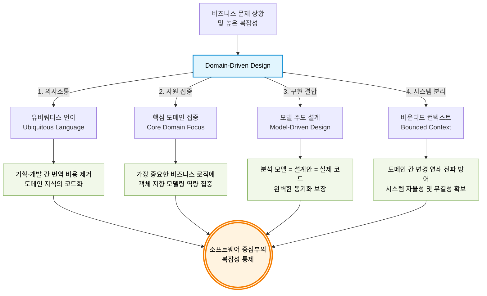

## 학습 로그 #01

### **시간**: 05/07 15:00 ~ 15:40 (약 40분)

### **학습 범위**: DDD 관점에서 AggregateRoot / Entity / VO

### 1. 막힌 것

> 개념에 대한 명확한 정의와 예시가 불명확하다

### 2. 학습 흐름

### `DDD`

#### `P` - DDD 의 근본적인 목적은?

- `캐모` : 객체의 책임을 명확히 분리해 유지보수성을 향상하기 위함
- `우디` : 글쎄요
- `그해` : 몰라요

---

`i` - 답변
> 문제 상황을 분석하고 정제한 모델을 기반으로  
> 문제 상황을 효과적으로 해결하기 위함
>
> 저 `모델` 이 도메인 객체이기에 객체 지향과의 연결점이 존재하는 것

`i` - 답변 분석
> DDD만의 근본적 목적을 놓친 반쪽짜리 정답.  
> 저서의 제목에서부터 드러나는
> #### `소프트웨어 중심부의 복잡성 통제`
> 가 근본적 목적이다.
>
> - 도메인 전문가(멘탈 모델)와 개발자(도메인 모델)의 불일치를 제거하고,  
    동일한 보편적 언어를 활용해 소프트웨어의 복잡성을 해소하고자 한다.
>
>
> - 도메인 모델과 멘탈 모델의 일치화
> - 도메인 모델의 분할과 핵심 도메인에 대한 집중
> - 도메인 모델과 코드의 결합

`i` - `DDD 의 근본적인 목적` 최종 정리
> "도메인 전문가와 개발자가 합의한 유비쿼터스 언어로 문제 상황을 정제하고,  
> 그 모델을 코드와 일치시켜 비즈니스의 핵심 복잡성을 안전하게 통제하기 위함"

---

`F` - 의문의 근원에 대한 분석

- `우디` : 현재 미션 구조에서 과연 어떤 도메인 모델들이 애그리거트 루트인가?
    - 모든 도메인 모델이 애그리거트의 조건을 충족하고, 엔드포인트가 존대한다.
    - 그렇다면 모든 도메인 모델이 애그리거트 루트인가?
    - 또한 그렇다면 각각에 대한 참조는 식별자 기반 참조여야 하지 않나?

현재 내 코드는 식별자 참조 -> 객체 참조로 변경된 구조.  
이유는?

- DDD 에서의 정의를 충족하기 위해 각각의 객체를 식별자 기반 참조로 끊어낸다면
- Reservation 객체가 스스로 행위하기 위해선 식별자를 기반으로  
  Time/Theme 를 조회해 와서 완결된 객체를 조립해야 한다.
- 과연 이것이 올바른 도메인 주도 개발이며 책임 분리인가?

> 아니다.  
> 이론적 정의를 위배하더라도  
> 객체가 스스로 역할과 책임을 수행할 수 있도록 하는 것이  
> 올바른 객체 지향이며 근본적 목표에 부합한다.
>
> 이 또한 마틴 파울러의 `실용적 예외` 에 속한다.

---

`S` DDD / AggregateRoot-Entity-VO mermaid 로 구조화

`R`

- [DDD](https://fabiofumarola.github.io/nosql/readingMaterial/Evans03.pdf)   
  Domain-Driven Design
  Tackling Complexity in the Heart of Software
- 제미나이
- [기존 코드리뷰](https://github.com/woowacourse/java-janggi/pull/316#discussion_r3056598532)
- [이번 코드리뷰](https://github.com/woowacourse/spring-roomescape-admin/pull/452#discussion_r3177320680)

---

### 3. 전략 평가

`중요한 점`

- 사실상 공부할 내용과 컨텍스트, 공부와 토론은 차고 넘친다
- 그것을 제대로 정리하고 내 것으로 만드는 것이 힘들 뿐

`개선할 점`

- 좀 더 체계적인 대화와 의논과 토의와 토론이
- 그리고 그것에 대한 정리와 복습이 필요하다

### 4. AI 피드백

- 자신의 학습 전략에 대해 AI 학습 전문가에게 피드백을 요청하고,
  유용했던 제안 1가지 이상 기록

`반란`

- 이미 학습 과정에서 많은 질의응답이 오갔고,
- 스스로의 결론에 대해 정리하는 것이 우선이라 생각해서
- 이번엔 딸깍을 보류하겠음

### 5. 다음 타임에 바꿀 것

비판적인 사고를 유지하고 더더욱 학습과 지식의 유실율을 줄이겠다 
