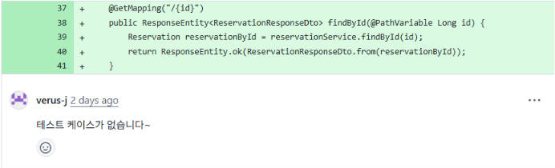

# 학습 로그 #02

**시간**: 05/11 10:30 ~ 11:30, 16:00 ~ 17:30 (약 150분)
**학습 범위**: Controller 테스트 작성

## 1. 막힌 것의 종류

이번에 막힌 것은 어떤 종류의 어려움이었는가? (해당하는 것에 체크)

- [ ] 개념 자체를 모르겠다 (예: "스프링 빈이 뭔지 모르겠다")
- [ ] 개념은 알겠는데 코드로 어떻게 쓰는지 모르겠다 (예: "JdbcTemplate 문법을 모르겠다")
- [ ] 코드는 돌아가는데 이게 맞는 건지 모르겠다 (예: "계층 분리를 이렇게 해도 되나?")
- [x] 기타: 코드도 모르고, 개념도 모르고, 단위테스트 기준도 모른다.

## 2. 이번 타임의 학습 전략

- 이전에 바꾸기로 한 전략은 무엇이었고, 실행했는가?
- 실제로 어떻게 학습했는지 디테일한 과정을 써보세요.

## 학습과정


컨트롤러 테스트가 부족하다는 피드백을 받았다.

컨트롤러 단위 테스트를 작성하면서 생긴 의문증에 대한 기록이다.

### MockMvc vs RestAssuredMockMvc

컨트롤러 단위 테스트를 확인하다 보니, MockMvc와 RestAssuredMockMvc가 있다는 것을 알게되었다.
그런데 어떤 차이가 있는지 몰라서, 문법을 비교해보았다.

1. MockMvc

```java
//    mockMvc.perform(get("/admin/reservations"))
//           .andExpect(status().isOk())
//           .andExpect(jsonPath("$", hasSize(1)))
//           .andExpect(jsonPath("$[0].name").value("유저1"));
```

2.RestAssuredMockMvc

```java
//    RestAssuredMockMvc.given()                 -> // given
//        .when().get("/admin/reservations")     -> // when
//        .then()                                -> // then
//        .status(HttpStatus.OK)
//        .body("[0].name", equalTo("유저1"));

```

RestAssuredMockMvc의 경우에는 `//given`, `//when`, `//then` 순서로 읽을 수 있기 때문에, RestAssuredMockMvc를 선택했다.

### 출력 테스트

```java
//    RestAssuredMockMvc.given()                 -> // given
//        .when().get("/admin/reservations")     -> // when
//        .then()                                -> // then
//        .status(HttpStatus.OK)
//        .body("id", equalTo(reservation.getId().intValue()));
```

나는 id를 체크하는 방식으로 확인을 하고 있었다.
그런데 각 값이 제대로 전달 되고 있는지 확인할 필요가 있다고 느꼈다.

`.extract().as(new TypeRef<>() {});` 를 이용해서 제네릭의 타입소거를 막았다.
제네릭 같은 경우에는 컴파일이 추론해주기 때문에, `List<ReservationResponseDto> `를 선언함으로써 받을 수 있었다.

```java
    List<ReservationResponseDto> actual = RestAssuredMockMvc.given()
        .when().get("/admin/reservations")
        .then()
        .status(HttpStatus.OK)
        .extract().as(new TypeRef<>() {
        });
```

### Controller에서 Status 케이스에 대한 테스트 코드 작성

```java

@Test
@DisplayName("유효한 요청으로 테마를 생성하면 201을 반환한다")
void createsTheme() {
    ThemeRequestDto requestDto = new ThemeRequestDto(
            theme.getName().getValue(), theme.getThumbnailUrl(), theme.getDescription());
    given(themeService.create(any())).willReturn(theme);
    ThemeResponseDto expected = ThemeResponseDto.from(theme);

    ThemeResponseDto actual = RestAssuredMockMvc.given()
            .contentType(MediaType.APPLICATION_JSON_VALUE)
            .body(requestDto)
            .when().post("/admin/themes")
            .then()
            .status(HttpStatus.CREATED)
            .header("Location", "http://localhost/admin/themes/" + theme.getId())
            .extract().as(ThemeResponseDto.class);

    assertThat(actual).isEqualTo(expected);
}

@ParameterizedTest(name = "{0}")
@MethodSource("invalidThemeRequests")
@DisplayName("유효하지 않은 요청으로 테마를 생성하면 400을 반환한다")
void returnsValidationError(String description, ThemeRequestDto invalidRequest) {
    RestAssuredMockMvc.given()
            .contentType(MediaType.APPLICATION_JSON_VALUE)
            .body(invalidRequest)
            .when().post("/admin/themes")
            .then()
            .status(HttpStatus.BAD_REQUEST);
}

@Test
@DisplayName("중복된 테마를 생성하면 409를 반환한다")
void returnsConflictWhenDuplicateTheme() {
    ThemeRequestDto requestDto = new ThemeRequestDto(
            theme.getName().getValue(), theme.getThumbnailUrl(), theme.getDescription());
    given(themeService.create(any())).willThrow(new ConflictException("이미 존재하는 테마명입니다."));

    RestAssuredMockMvc.given()
            .contentType(MediaType.APPLICATION_JSON_VALUE)
            .body(requestDto)
            .when().post("/admin/themes")
            .then()
            .status(HttpStatus.CONFLICT);
}
```

여러 상태에 대한 테스트를 진행하고 있다.
그런데 여러 상태코드에 대해서 진행하기 때문에 Service의 코드가 변경되면 테스트도 변경되어야 한다.
그렇기 때문에, 테스트를 분리하는게 맞다고 생각한다.
그렇지 않다면 비슷한 테스트가 모든 Controller에서 반복될 것이다.

변경 이후:

```java

@Test
@DisplayName("유효한 요청으로 테마를 생성하면 201을 반환한다")
void createsTheme() {
    ThemeRequestDto requestDto = new ThemeRequestDto(
            theme.getName().getValue(), theme.getThumbnailUrl(), theme.getDescription());
    given(themeService.create(any())).willReturn(theme);
    ThemeResponseDto expected = ThemeResponseDto.from(theme);

    ThemeResponseDto actual = RestAssuredMockMvc.given()
            .contentType(MediaType.APPLICATION_JSON_VALUE)
            .body(requestDto)
            .when().post("/admin/themes")
            .then()
            .status(HttpStatus.CREATED)
            .header("Location", "http://localhost/admin/themes/" + theme.getId())
            .extract().as(ThemeResponseDto.class);

    assertThat(actual).isEqualTo(expected);
}
```

- 404, 409 Exception은 단위테스트로 분리
    - 이렇게 함으로써 Controller의 중복 체크를 없앴다.

## 3. 전략 평가

- 효과적이었던 것과 그 이유
- 비효과적이었던 것과 그 이유
- 막힌 것의 종류(1번)와 전략의 궁합은 어땠는가?

## 4. AI 피드백

- 자신의 학습 전략에 대해 AI 학습 전문가에게 피드백을 요청하고,
  유용했던 제안 1가지 이상 기록

## 5. 다음 타임에 바꿀 것

- 유지할 것과 그 이유
- 바꿀 것과 그 이유
