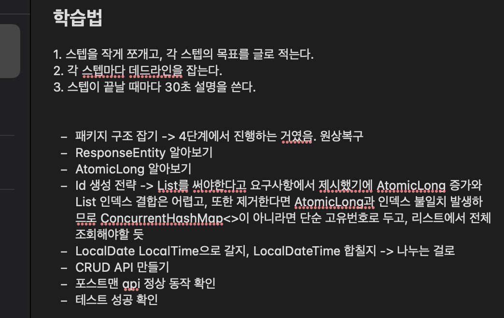

## 학습 로그 #1

**시간**: 04/28 14:50 ~ 17:50 (약 3시간)

**학습 범위**: 1단계 MVC

### 1. 막힌 것의 종류
이번에 막힌 것은 어떤 종류의 어려움이었는가? (해당하는 것에 체크)
- [ ] 개념 자체를 모르겠다 (예: "스프링 빈이 뭔지 모르겠다")
- [ ] 개념은 알겠는데 코드로 어떻게 쓰는지 모르겠다 (예: "JdbcTemplate 문법을 모르겠다")
- [ ] 코드는 돌아가는데 이게 맞는 건지 모르겠다 (예: "계층 분리를 이렇게 해도 되나?")
- [x] 기타:
    - 습관적으로 패키지 구조부터 나누고 시작했다가, 4단계에서 계층 분리하는 걸 확인하고 초기화 후 다시 시작 (16:45)

### 2. 이번 타임의 학습 전략
- 이전에 바꾸기로 한 전략은 무엇이었고, 실행했는가?
  - `해야 할 일을 스텝별로 나누고, 글로 명시해두기`
    - 하지만 중간에 또 과몰입해서 눈을 뜨고 보니 한번에 전체를 만들어버리고 말았다.
    - 중간에 코드를 전체 삭제한 뒤부터는 다시 차근차근 진행했다.
- 실제로 어떻게 학습했는지 디테일한 과정을 써보세요.
  - 
    - 계속 메모를 띄워두고, 과몰입해서 스텝을 잊지 않도록 주의했다.
    - 하지만, 시작 직후 패키지 구조를 잡은 뒤 걷잡을 수 없이 계속 뻗어나가버려서 2시간이 소모되고 말았다.. 전체 삭제 후 다시 시작하고나서는 다시 스텝별로 차근차근 진행했다.

### 3. 전략 평가
- 효과적이었던 것과 그 이유
  - `스텝을 작게 쪼개고, 각 스텝의 목표를 글로 적는다`
    - 나는 순간 과몰입해서 빠져드는 경향이 있는데, 의식적으로 메모를 보며 정신이 빠져나가지 않도록 붙잡을 수 있었다. 
- 비효과적이었던 것과 그 이유
  - `30초 설명`
    - 1단계에서는 크게 새로운 기술을 배우지 않아서, 사용하지 않았는데 비효과적이라 생각하진 않는다. 
- 막힌 것의 종류(1번)와 전략의 궁합은 어땠는가?
  - 전략은 아주 좋았는데, 전략 적용 대상(나)이 문제였다.
  - 하지만 의식적으로 바로잡으려고 노력하고 있다.

### 4. AI 피드백
- 자신의 학습 전략에 대해 AI 학습 전문가에게 피드백을 요청하고,
  유용했던 제안 1가지 이상 기록

### 5. 다음 타임에 바꿀 것
- 유지할 것과 그 이유
  - `스텝을 작게 쪼개고, 각 스텝의 목표를 글로 적는다`
    - 이건 무조건 유지할 건데, 내가 과몰입해서 의식이 DFS하지 않도록 도와주었기 때문이다.
  - `각 스텝마다 데드라인을 잡는다.`
    - 이건 오랜만에 스프링으로 개발을 해서 데드라인을 어느정도로 잡아야할지 감이 오지 않아서, 이번 단계에선 사용하지 않았지만 유지하려고 한다.
  - `스텝이 끝날 때마다 30초 설명을 쓴다.`
    - 유지는 하는데, 모든 스텝에 적용하기보다는 중간에 새로 알게된 부분이 있다면 부분 적용하려고 한다.
- 바꿀 것과 그 이유
  - 딱히 바꾸고 싶은 항목은 없다.
